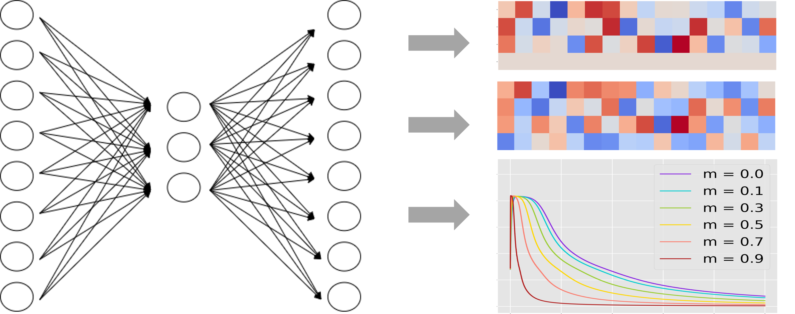
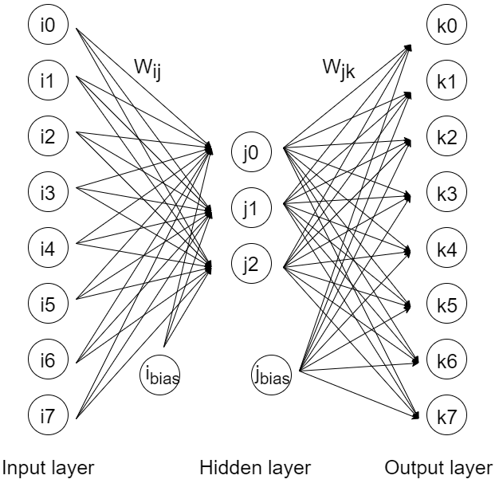
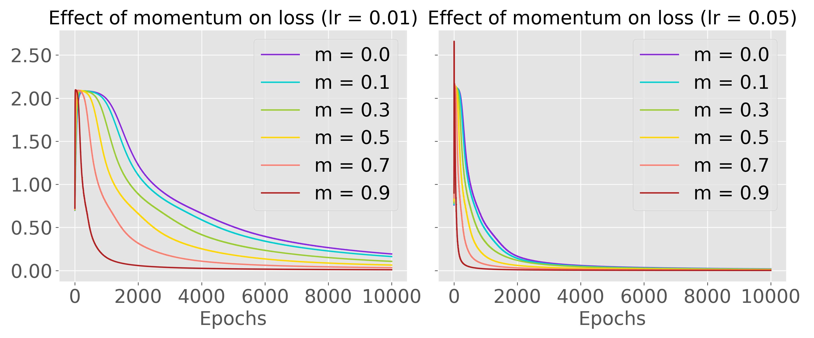
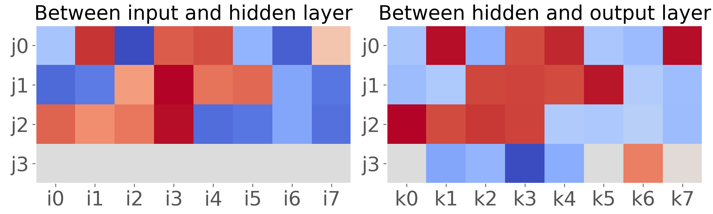
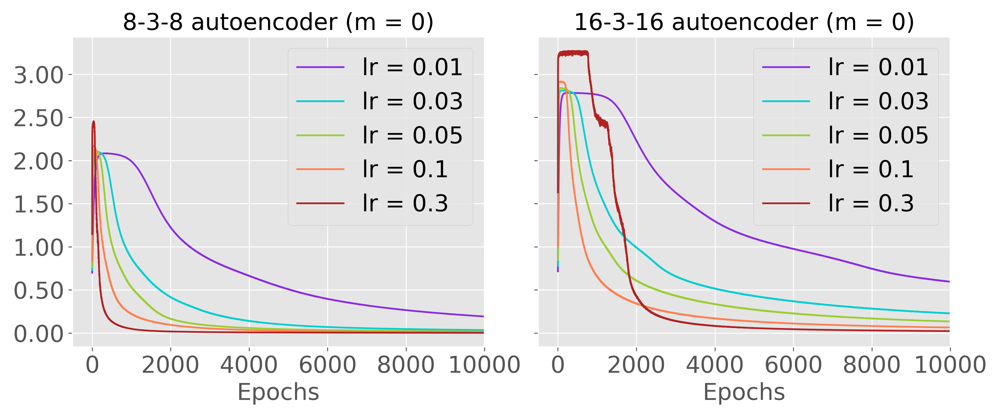
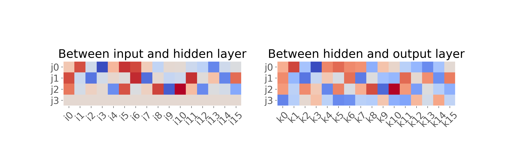

# Self-supervised learning with autoencoders
This is a classical autoencoder written in C, along with a mini-library for matrix operations.

## Problem description
Suppose we want to train a neural network to encode an input vector with one 1 and seven 0's, corresponding to the 8 cases below.

| n | t0 | t1 | t2 | t3 | t4 | t5 | t6 | t7 |
| - | - | - | - | - | - | - | - | - |
| 1 | 1 | 0 | 0 | 0 | 0 | 0 | 0 | 0 |
| 2 | 0 | 1 | 0 | 0 | 0 | 0 | 0 | 0 |
| ... | ... | ... | ... | ... | ... | ... | ... | ... |
| 7 | 0 | 0 | 0 | 0 | 0 | 0 | 1 | 0 |
| 8 | 0 | 0 | 0 | 0 | 0 | 0 | 0 | 1 |

The 8 input vectors correspond to the one-hot encoding of 8 categorical variables — a relatively easy pattern for the network to learn to encode and decode. This can be most efficiently done using 3 binary bits. We will train a network to learn the binary representation of this input vector.

## Encoding 8 categories with 3 bits
I trained a multi-layer perceptron to encode with 3 units a one-hot encoded vector of length 8. For the sake of clarity and terminology of indices used, here is a visual representation of the network, showing the i, j, and k indices used to describe the input, hidden, and output layer units, and the weights between them.

Here are the details of the multi-layer perceptron needed for its reconstruction:

| Hyperparameter | Info | Equation |
|-|-|-|
| activation function *g* | sigmoid | activation  , derivative  |
| loss | binary cross-entropy |  |
| optimizer | classical momentum | learning rate  , momentum |
| weights initialization | random uniform | between -0.1 and 0.1 |

Our loss function is binary cross-entropy, defined as:

where **t** is the target one-hot encoded vector, and **p** is the output layer activation (a probability vector), summation over *k* from k=1 to k=8 (N) in our case. 

The derivatives of binary cross-entropy loss with respect to weights worked out to be:

for weights between hidden layer j and output layer k, and 

for weights between the input and hidden units.

## Training results

With standard gradient descent, training was slow, even at high learning rates of up to 10 (refer to left insert of above figure). Thus, I added a momentum term involving the previous time step as a modification to vanilla gradient descent. The weight update heuristic at epoch *t* becomes:

for a pair of connected neurons *i* and *j* (or *j* and *k* for that matter), and where *m* is scalar that practitioners suggest to be kept between 0 and 1. The result in training with varying *m*, for two different learning rates (lr = 0.01 and lr = 0.05) is shown in the plots above.

## How the 8-3-8 autoencoder learns to encode its input

How is the network learning to encode input vectors? We look at the final state of the weights for the best network to see what is happening.

Without loss of generality, what the network has learned is to match the signs between mirrored pairs of weights . For example, if *t* is , then only j0 and k0 will fire, producing a large positive activation in output node k0 because  and 
 have the same sign (does not matter whether positive or negative). The two other hidden units also have synergistic weights entering/leaving them, but they will stay silent because the inputs into those units is 0. 

## Encoding a 16-bit one-hot vector with 3 bits

Is it possible to be even more efficient and encode a one-hot vector \textit{twice} the size as our previous vector, with 3 hidden units? If each hidden unit can represent 3 activation states, then we can encode up to a one-hot vector of length 3^n = 3^3 = 27. As we are using a sigmoid activation, the three activation states are naturally 0, 0.5, and 1, requiring asymptotic input values of -Inf, 0, and Inf at each hidden unit. While our loss will never reach 0, it is theoretically possible to train such a network.

To try this out, I trained a multi-layer perceptron to encode with 3 units a one-hot encoded vector of length **16**. The training results are shown below. 

As per our predictions, the autoencoder is still able to encode a one-hot representation of 16 different inputs. Training is slower, because there are more weights to adjust, but binary cross-entropy is reduced to a comparably small value after around 10000 epochs. We now looka at the weights of this 16-3-16 autoencoder.

## How the 16-3-16 autoencoder learns to encode its input

Visualizing the weight matrices in heatmap above, we see that the network is again solving the problem by mirroring the sign of the weights. Additionally, it mirrors the relative magnitude of the weights. This time, each hidden node has three states, as the mirrored incoming and outgoing weights are in one of negative (blue), zero (off-white), and positive (red). The connections entering output node 14 (k14) look all negative, but this is offset by the positive bias (). Again, the bias in the input layer is not doing much (it cannot be any other value than 0 otherwise non-1 units will fire), but the bias in the hidden layer is helping to adjust the median weight to zero.

## Project structure
The code for the 8-unit multi-layer perceptron is available as `testmlp.c`, and the code for the 16-unit multi-layer perceptron is found in `testmlp16.c`. They are hard-coded in terms of the number of units and the inputs they accept. The `utils.c` is the definitions file for simple matrix operations (e.g., dot product, hadamard product, and scalar operations). The `output` directory contains the .csv files used to generate the plots. Jupyter notebooks for generating the plots are not included.
