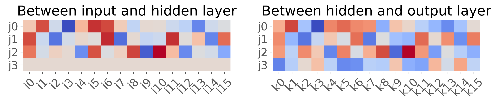

# Self-supervised learning with autoencoders
This is a classical autoencoder for intended for CPU training, that is written in optimized code using C. 

## Problem description
We want to train a neural network to encode a one-hot encoded input vector that represents the digits 1 to 8 into a vector of length < 8, and to also reconstruct the original input given the encoding.

| target | 0 | 1 | 2 | 3 | 4 | 5 | 6 | 7 |
| - | - | - | - | - | - | - | - | - |
| 1 | 1 | 0 | 0 | 0 | 0 | 0 | 0 | 0 |
| 2 | 0 | 1 | 0 | 0 | 0 | 0 | 0 | 0 |
| 3 | 0 | 0 | 1 | 0 | 0 | 0 | 0 | 0 |
| 4 | 0 | 0 | 0 | 1 | 0 | 0 | 0 | 0 |
| 5 | 0 | 0 | 0 | 0 | 1 | 0 | 0 | 0 |
| 6 | 0 | 0 | 0 | 0 | 0 | 1 | 0 | 0 |
| 7 | 0 | 0 | 0 | 0 | 0 | 0 | 1 | 0 |
| 8 | 0 | 0 | 0 | 0 | 0 | 0 | 0 | 1 |

As seen above, the 8 input vectors correspond to the rows of a 8x8 identity matrix — a relatively easy pattern for the network to learn to encode and decode. We will start off with attempting to teach the network a binary representation of this input.

## Encoding a 8-bit one-hot vector with 3 bits
I trained a multi-layer perceptron to encode with 3 units a one-hot encoded vector of length 8. Here are the hyperparameters of the autoencoder:

| feature | details | details |
|-|-|-|
| activation | sigmoid | *equation |
| loss | binary cross-entropy | **equation |
| optimizer | classical momentum | m=0-0.9 |
| learning rate | min 0.01 | max 1.0 |
| weights initialization | random uniform | between -0.1 and 0.1 |

Sigmoid activation equation:

Binary cross-entropy loss equation:

where **t** is the target one-hot encoded vector, and **p** is the output layer activation (a probability vector) and N is 8 in our case. The derivatives of binary cross-entropy loss with respect to weights worked out to be:

